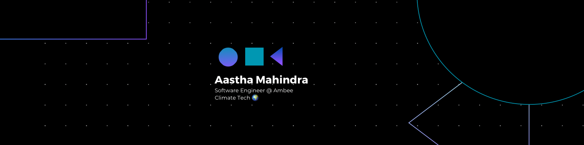

<h1 align="center">Hi 👋, I'm Aastha Mahindra</h1>

  

  📫 How to reach me: <strong>aastha.mahindra125@gmail.com</strong>
   
  ⚡ Fun fact: <strong>I'm obsessed with Travelling 🌏</strong>

---

<h2 align="center">Connect with me</h2>

  
  &nbsp;&nbsp;
  
  &nbsp;&nbsp;
  

<!-- <h2 align="center">Languages and Tools</h2>

 

 -->

---

  

  

  

