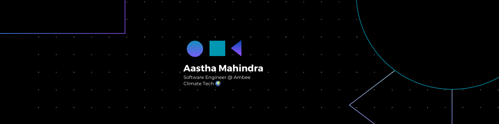

<h1 align="center">Hi 👋, I'm Aastha Mahindra</h1>

- 🌱 I’m currently learning **to build APIs using GraphQL.**

- 💬 Ask me about **Android, Spring Boot, and Node JS.**

- 📫 How to reach me **aastha.mahindra125@gmail.com**

- ⚡ Fun fact **I'm obsessed with Travelling 🌏**

<h2 align="left">Connect with me:</h2>

&nbsp&nbsp
 
&nbsp&nbsp
<!--  -->

<h2 align="left">Languages and Tools:</h2>

  
&nbsp&nbsp
 
&nbsp&nbsp
 
&nbsp&nbsp

&nbsp&nbsp
 
&nbsp&nbsp
 
&nbsp&nbsp
 
 
 
&nbsp&nbsp
 
&nbsp&nbsp
 
&nbsp&nbsp
 
&nbsp&nbsp
 
&nbsp&nbsp
 
&nbsp&nbsp
 

 

&nbsp;
 

